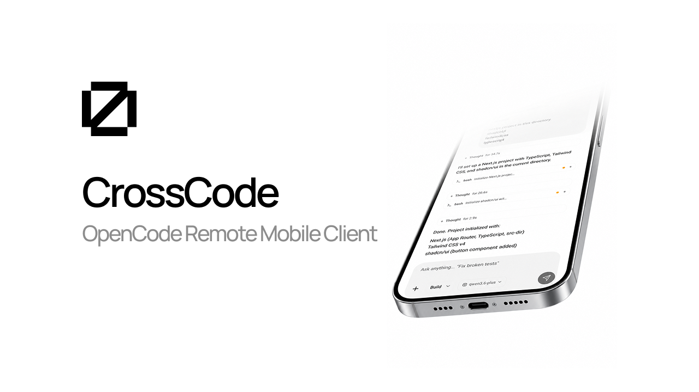

[](https://crosscode.site)

# CrossCode

Control your PC's [OpenCode](https://opencode.ai) (the terminal AI coding agent) from your phone, from anywhere in the world. Free, open source, and private. Your code never touches CrossCode's servers, because there are none.

[](https://opensource.org/licenses/MIT)
[](https://www.npmjs.com/package/crosscode)
[](https://nodejs.org)

## What is CrossCode?

CrossCode streams a live OpenCode session from your computer to your phone over a secure tunnel. You get real-time chat, streaming responses, inline diffs, tool-call approvals, a Git panel, voice input, push notifications, and more. Your code is never uploaded to a cloud.

There are two ways to connect:

| Mode | Tunnel | Account needed? | URL |
|---|---|---|---|
| Free | Cloudflare or ngrok | No | Random, changes each session |
| Dedicated | CrossCode Tunnel | Yes (free or paid login) | Stable `*.connect.crosscode.site` |

We recommend logging in. It gives you a stable, dedicated URL so you don't have to re-scan a new QR code every time you restart.

## Prerequisites

- A computer (Windows, macOS, or Linux) with [OpenCode](https://opencode.ai) installed
- Node.js 20 or newer (only needed for the CLI wrapper; OpenCode itself is a standalone binary)
- A phone with the CrossCode app ([Android](https://crosscode.site/download); iOS coming soon)
- For free tunnels: `cloudflared` (the CLI will guide you if it's missing) or `ngrok`

---

## Install OpenCode (by operating system)

CrossCode needs a running `opencode serve` on your machine. Install OpenCode first.

### macOS

```bash
# Recommended (always up to date)
brew install anomalyco/tap/opencode

# Or the official install script
curl -fsSL https://opencode.ai/install | bash
```

### Linux

```bash
# Debian/Ubuntu or any distro with Homebrew
brew install anomalyco/tap/opencode

# Arch (stable)
sudo pacman -S opencode

# Arch (latest from AUR)
paru -S opencode-bin

# Or the official install script (any distro)
curl -fsSL https://opencode.ai/install | bash
```

### Windows

Windows has two good options.

**Option A - WSL2 (recommended for the best experience)**

```powershell
# 1. Install WSL2, then open your WSL terminal and run:
curl -fsSL https://opencode.ai/install | bash
```

**Option B - Native Windows**

```powershell
# Chocolatey
choco install opencode

# or Scoop
scoop install opencode

# or npm
npm install -g opencode-ai
```

If you use WSL, run CrossCode inside WSL too (see the Windows workflow below). Windows and WSL have separate PATHs and home directories.

Verify the install on any OS:

```bash
opencode --version
```

---

## Install the CrossCode CLI (by operating system)

The CLI (`crosscode`) does all the setup for you. It starts `opencode serve`, opens a tunnel, and prints a QR code.

### macOS or Linux

```bash
# Run instantly (no install needed)
npx crosscode

# Or install globally
npm install -g crosscode
```

### Windows (native)

```powershell
# Run instantly
npx crosscode

# Or install globally
npm install -g crosscode
```

> **Note:** We recommend `npx crosscode@latest` over global install so you always pull the latest changes without needing to manually update.

### Windows (WSL2)

Run the same commands inside your WSL terminal. Node.js must be installed in WSL:

```bash
# Install Node.js in WSL if you don't have it
curl -fsSL https://deb.nodesource.com/setup_20.x | sudo -E bash -
sudo apt-get install -y nodejs

# Then run CrossCode
npx crosscode
```

Tip: `npx crosscode@latest` always uses the latest version. If you installed it globally, run `npm update -g crosscode` to upgrade.

---

## Step-by-Step: From Zero to Connected

Follow these in order. OS-specific install commands are in the sections above.

### 1. Install OpenCode on your computer
Pick your OS in the Install OpenCode section and run the command. Verify with `opencode --version`.

### 2. Log in for a dedicated tunnel (recommended)
Logging in gives you a stable, dedicated URL at `*.connect.crosscode.site`. You can reconnect from your phone without re-scanning a fresh QR code every session.

```bash
npx crosscode login
```

1. Your browser opens `https://crosscode.site/login`
2. Log in with your email (one-time code) on the dashboard and copy your API key
3. Paste the API key back into the terminal

Your credentials are saved to `~/.crosscode/config.json`. Check status anytime with `npx crosscode status`, or clear it with `npx crosscode logout`.

Skipping login? That's fine. You'll use the free Cloudflare or ngrok tunnel instead. Make sure `cloudflared` or `ngrok` is installed (the CLI will tell you if it's missing and how to install it). Your tunnel URL will change each time you start.

### 3. Start CrossCode in your project directory
Open a terminal in the folder you want to work in and run:

```bash
npx crosscode
```

This will:
- Start `opencode serve` in the current directory
- Open your tunnel (dedicated if logged in, otherwise Cloudflare or ngrok)
- Print a QR code in your terminal

Keep this terminal open while you use your phone.

### 4. Install the mobile app and connect
1. Install CrossCode on your phone ([Android](https://crosscode.site/download); iOS coming soon)
2. Open the app and scan the QR code shown in your terminal
3. You're connected. Start chatting with your agent

### 5. Stay connected across restarts (optional)
Because the dedicated tunnel gives you a stable URL, you can reopen the app later and reconnect to the same session without scanning again. Just make sure `npx crosscode` is running on your PC.

That's the whole setup. Your code never leaves your machines. CrossCode only relays the live session traffic.

---

## Tunnel Options

| Condition | Tunnel Used |
|---|---|
| Logged in (any tier) | CrossCode Tunnel (`*.connect.crosscode.site`) |
| `--ngrok` flag | ngrok |
| `--cloudflared` flag | cloudflared |
| Not logged in, no flag | cloudflared (fallback) |
| CrossCode tunnel fails | cloudflared (automatic fallback) |

```bash
npx crosscode                 # auto-selected tunnel (dedicated if logged in)
npx crosscode --cloudflared   # force Cloudflare tunnel
npx crosscode --ngrok         # force ngrok tunnel
```

If you use `--ngrok`, set your auth token first: `ngrok config add-authtoken <TOKEN>`.

### Installing cloudflared (free tier)

The free tunnel needs `cloudflared`. If it's missing, the CLI will detect it and guide you. You can also install it ahead of time:

```bash
# macOS or Linux (Homebrew)
brew install cloudflared

# Debian/Ubuntu
curl -fsSL https://github.com/cloudflare/cloudflared/releases/latest/download/cloudflared-linux-amd64.deb -o /tmp/cloudflared.deb
sudo dpkg -i /tmp/cloudflared.deb

# Windows (native)
winget install cloudflare.cloudflared
# or: choco install cloudflared
```

---

## Interactive Controls

While the tunnel is running:

| Key | Action |
|---|---|
| `l` | Toggle log viewer (last 20 lines from CrossCode, tunnel, and OpenCode) |
| `Ctrl+C` | Graceful shutdown that kills all child processes and exits |

---

## How It Works

Your phone connects to the OpenCode instance running on your machine through a secure tunnel. It streams everything back in real time: prompts, streaming responses, tool-call approvals, and file diffs. Your source code stays on your computer. The relay only forwards the encrypted session stream.

## Documentation

- [CLI Reference](docs/cli.md) - all commands, flags, tunnel options, config, and environment variables
- [Development](docs/development.md) - set up and build the project locally
- [Features](docs/features.md) - what CrossCode can do
- [Tunnel Server](docs/tunnel-server/README.md) - self-hosted relay for paid users

## Contributing

Contributions are welcome. See [CONTRIBUTING.md](CONTRIBUTING.md).

## License

MIT. See [LICENSE](LICENSE).
